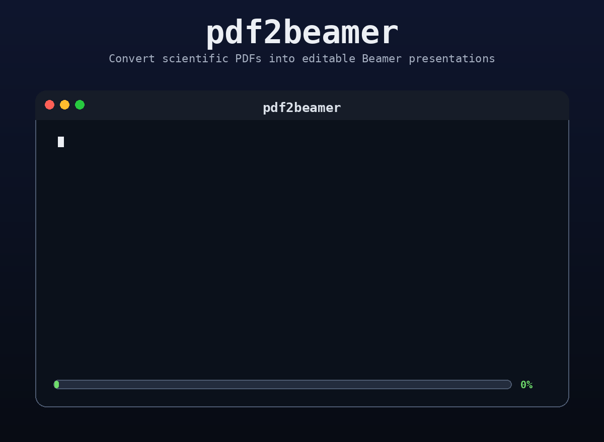

# pdf2beamer

<p align="center">
  
</p>
`pdf2beamer` is a local-first Python package for converting native scientific
PDF papers into editable, compilable Beamer presentations.

The project is intentionally structured around inspectable intermediate
representations:

```text
PDF -> PaperIR -> ArgumentGraph -> DeckPlan -> SlideIR -> Beamer
```

The package defines strict Pydantic v2 data models and keeps real Docling, PyMuPDF, Nemotron generation, validation, rendering, and compilation behind local integration points.
<p align="center">
  
</p>


## Constraints

- No external API calls.
- No OCR or scanned-PDF fallback.
- Local Nemotron generation plus Qwen embedding/reranking adapters are dependency-injected.
- LLM components generate structured JSON only.
- Beamer is rendered deterministically from `SlideIR`.

## Public API Sketch

```python
from pdf2beamer import PdfToBeamerPipeline, PipelineConfig

config = PipelineConfig(
    model_path="./models/nemotron-3-nano-4b-gguf/NVIDIA-Nemotron-3-Nano-4B-Q4_K_M.gguf",
    embedding_model_path="./models/Qwen3-Embedding-0.6B",
    reranker_model_path="./models/Qwen3-Reranker-0.6B",
    duration_minutes=10,
    audience="technical",
    theme="clean",
)

pipeline = PdfToBeamerPipeline(config)
result = pipeline.generate("paper.pdf", "out/")
```

## Local Models

Real model and PDF backends are optional. The base package imports without
installing heavy extraction or model dependencies, and the library never
downloads model files at runtime.

Install the base package:

```bash
pip install pdf2beamer
```

With local model download and inference support only:

```bash
pip install "pdf2beamer[models]"
```

With the full local pipeline for native PDFs and real local models:

```bash
pip install "pdf2beamer[models,pdf,docling]"
```

Download default models into `./models/`:

```bash
pdf2beamer download-models .
```

Expected local files, auto-detected by `--real-models` when present:

- Generation: `models/nemotron-3-nano-4b-gguf/NVIDIA-Nemotron-3-Nano-4B-Q4_K_M.gguf`
- Embedding: `models/Qwen3-Embedding-0.6B`
- Reranking: `models/Qwen3-Reranker-0.6B`

You can override paths with `--model`, `--embedding`, or `--reranker`.

Model files are local assets and should not be committed. Store them under
`models/`; `.gitignore` excludes `models/` and common model-weight formats.


### Download Models From Hugging Face

The `models` extra includes Hugging Face download tooling. If your Hugging Face account needs access to a model, authenticate once:

```bash
hf auth login
```

Download the expected local model layout:

```bash
pdf2beamer download-models .
```

Equivalent manual Hugging Face commands:

```bash
mkdir -p models/nemotron-3-nano-4b-gguf \
  models/Qwen3-Embedding-0.6B \
  models/Qwen3-Reranker-0.6B

hf download nvidia/NVIDIA-Nemotron-3-Nano-4B-GGUF \
  NVIDIA-Nemotron-3-Nano-4B-Q4_K_M.gguf \
  --local-dir models/nemotron-3-nano-4b-gguf

hf download Qwen/Qwen3-Embedding-0.6B \
  --local-dir models/Qwen3-Embedding-0.6B

hf download Qwen/Qwen3-Reranker-0.6B \
  --local-dir models/Qwen3-Reranker-0.6B
```

Quick local check:

```bash
test -f models/nemotron-3-nano-4b-gguf/NVIDIA-Nemotron3-Nano-4B-Q4_K_M.gguf
test -d models/Qwen3-Embedding-0.6B
test -d models/Qwen3-Reranker-0.6B
git check-ignore -v models/nemotron-3-nano-4b-gguf/NVIDIA-Nemotron-3Nano-4B-Q4_K_M.gguf
```

Then run with real local models. Use `--no-compile` if you only want the editable `out/main.tex` file:

```bash
uv run --extra pdf --extra docling --extra models pdf2beamer generate paper.pdf --real-models --no-compile
```

## LaTeX Compilation

`pdf2beamer` always writes `out/main.tex`. To also produce `out/main.pdf`, install a TeX distribution that provides the `latexmk` command, then run without `--no-compile`.

Debian/Ubuntu:

```bash
sudo apt update
sudo apt install latexmk texlive-latex-recommended texlive-latex-extra texlive-fonts-recommended
```

Windows:

```powershell
winget install --id MiKTeX.MiKTeX --exact
winget install --id StrawberryPerl.StrawberryPerl --exact
```

MiKTeX provides the TeX toolchain, and `latexmk` needs Perl on Windows. Restart the terminal after installation so the updated `PATH` is visible.

macOS:

```bash
brew install --cask mactex-no-gui
```

Check that `latexmk` is available:

```bash
latexmk --version
```

Compile during generation:

```bash
uv run --extra pdf --extra docling --extra models pdf2beamer generate paper.pdf --real-models
```

Fake-model command for lightweight local development:

```bash
pdf2beamer generate paper.pdf \
  --use-fake-models \
  --duration 10 \
  --output out/
```

Real local-model command:

```bash
pdf2beamer generate paper.pdf \
  --real-models \
  --duration 10 \
  --audience technical \
  --output out/
```

### Structured GGUF Output

The GGUF generator is exposed as `LocalNemotronGenerator` and loads a local Nemotron instruct GGUF through `llama-cpp-python`.
For `ArgumentGraph` and `SlideIR`, it first tries Instructor's local
`llama-cpp-python` integration:

```python
instructor.patch(
    create=llama.create_chat_completion_openai_v1,
    mode=instructor.Mode.JSON_SCHEMA,
)
```

This path returns Pydantic response models directly and retries validation
failures. If Instructor or the OpenAI-compatible llama.cpp method is unavailable,
the generator falls back to llama.cpp `response_format` JSON schema/object mode,
then to strict JSON parsing.

CLI controls:

```bash
pdf2beamer generate paper.pdf \
  --real-models \
  --instructor \
  --instructor-max-retries 2 \
  --no-compile \
  --output out/
```

Disable Instructor and use llama.cpp response format fallback:

```bash
pdf2beamer generate paper.pdf --real-models --no-instructor --output out/
```
